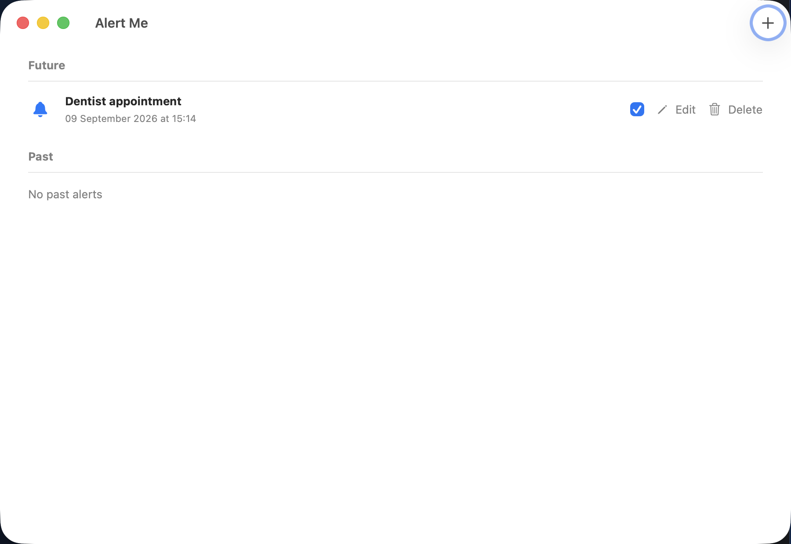

# Alert Me

Alert Me is a native macOS 26 Tahoe app for one-time and recurring popup alerts. It stays available from the menu bar, presents due alerts above other apps, and can use macOS notifications as a fallback.



## Requirements

- macOS 26 Tahoe
- Xcode 26.6 or later to build the app

Xcode is required only to build or update Alert Me from this repository. After installation, Alert Me runs as a standalone application without Xcode being open.

## Install and run as a standalone Mac app

From the repository root, run:

```shell
./scripts/install.sh
```

The installer:

1. Builds a Release version of Alert Me.
2. Installs it as `~/Applications/Alert Me.app`.
3. Registers it with macOS Launch Services.
4. Asks Spotlight to index it.

After installation, start Alert Me using any standard macOS method:

- Press <kbd>Command</kbd>+<kbd>Space</kbd>, search for **Alert Me**, and press <kbd>Enter</kbd>.
- Open `~/Applications` in Finder and double-click **Alert Me**.
- Run:

  ```shell
  open "$HOME/Applications/Alert Me.app"
  ```

To install and launch the app in one command:

```shell
./scripts/install.sh --open
```

Alert Me does not appear in the Dock by default. Use its alarm-clock icon in the menu bar to reopen the main window, open Settings, or quit. To show the app in the Dock, enable **Show Alert Me in the Dock** under **Alert Me > Settings**.

### Install an updated build

After pulling or making changes, run `./scripts/install.sh` again. The installer replaces the installed app with the latest Release build. Existing alert data and preferences are stored separately and are not removed.

### Spotlight troubleshooting

The installer registers and indexes the app automatically. If Spotlight does not show Alert Me immediately:

1. Confirm that `~/Applications/Alert Me.app` exists.
2. Wait briefly for Spotlight to refresh.
3. Run `./scripts/install.sh` again.
4. Open the app directly with `open "$HOME/Applications/Alert Me.app"`.

## Notification signing

Popup alerts work while Alert Me is running. Fallback macOS notifications require a valid development or distribution signature. A build signed only with **Sign to Run Locally** may be unable to request notification permission.

For local notification testing:

1. Open **Xcode > Settings > Accounts** and add your Apple ID.
2. Select the `AlertMe` project and the `AlertMe` target.
3. Under **Signing & Capabilities**, select your Development Team.
4. Run `./scripts/install.sh` again.
5. Open Alert Me and select **Allow Notifications**.

Sharing the app with other people requires a Developer ID signature and Apple notarization. A locally signed build is intended only for the Mac that built it.

## Features

- Create one-time, daily, weekly, monthly, or yearly alerts.
- Enter messages of up to 500 characters.
- Fire alerts at second zero as soon as the selected minute begins.
- Set dates and times independently, or use **Now** to copy the current date and time.
- Display one-time alert dates as `09 September 2026`.
- Choose one app-wide macOS system sound or make individual alerts silent.
- Repeat the sound every five seconds, up to 20 additional times, until dismissal.
- Keep running when the management window is closed.
- Optionally open at login and appear in the Dock.
- Choose Light or Dark mode, with Light mode as the default.
- Edit, enable, disable, or immediately delete alert definitions.

Missed alerts are recorded but are not replayed after the Mac wakes or the app reopens. Explicitly quitting or force-quitting Alert Me prevents popup alerts until it is opened again. Fallback notifications are delayed briefly and canceled when the app successfully presents its popup.

## Development

Open `AlertMe.xcodeproj`, select the `AlertMe` scheme, and run the app.

Run the complete test suite after every Swift, test, project configuration, script, or app behavior change:

```shell
./scripts/test.sh
```

The suite includes:

- Scheduling and recurrence tests, including DST, leap-year, and calendar boundaries.
- Validation and date-format tests.
- SwiftData persistence integration tests.
- Notification authorization and fallback policy tests.
- Sound repetition and cancellation tests.
- App setting persistence tests.
- AppKit alert panel tests.
- UI tests for the empty state and alert creation and deletion.
- An isolated integration test for the standalone installer.

Regenerate the privacy-safe README screenshot with:

```shell
./scripts/capture-readme-screenshot.sh
```

The app uses SwiftUI, AppKit, SwiftData, UserNotifications, and ServiceManagement with Swift 6 strict concurrency.

## Manual verification

Some operating-system integrations require testing on a real Mac:

1. Grant and deny notification permission, then confirm the Settings guidance.
2. Run a signed app bundle and verify launch-at-login registration.
3. Confirm the alert panel appears over other apps, Spaces, and full-screen apps.
4. Put the Mac to sleep across an alert time and confirm the missed alert is not replayed.
5. Confirm explicitly quitting the app stops popup alerts until relaunch.
6. Preview the available system sounds and confirm silent alerts do not play them.
7. Confirm Spotlight finds the installed app and the menu-bar controls remain available while the Dock icon is hidden.
